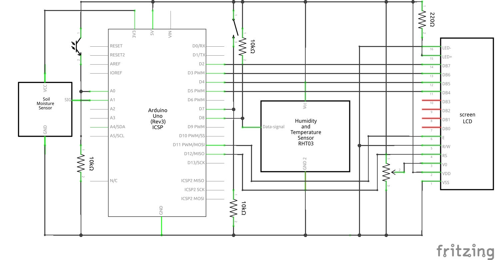

# Gardener’s Multi-Tool

A four-function device to give gardeners insight on the conditions affecting their plants.

## About

My wife is an avid gardener and was thrilled by the size of our new apartment’s patio when we moved towards the end of 2021. Having a growing interest in C++, and wanting to encourage my wife’s “plant habit”, I decided to create the Gardener’s Multi-Tool as a Christmas gift. I had discovered Arduino a few years earlier but had not yet created anything sophisticated. This proved to be an exciting opportunity to do just that by getting “closer to the metal” with some hands-on soldering and a lower-level language.

## Getting started

### Schematic



### Components

Required components:

- One Arduino Uno Rev3
- One capacitive soil moisture sensor
- One DHT sensor module (DHT11 or DHT22)
- One phototransistor
- One two-row LCD display
- One push button
- One potentiometer
- One 220 Ω resistor
- Three 10 kΩ resistors

### Software

You will need software that is capable of uploading and verifying Arduino sketches. Two options are the [Arduino IDE](https://www.arduino.cc/en/software) and the [Arduino extension](https://marketplace.visualstudio.com/items?itemName=vsciot-vscode.vscode-arduino) for [Visual Studio Code](https://code.visualstudio.com/). The maintainer used Visual Studio Code and the Arduino extension.

### Configuration

Before uploading the sketch to the Arduino board, you should take a moment to look over the `config.h` header file in the root directory. All of these values can be changed to accomodate your particular components and environment. 

The following are of particular interest:

- `dhtSensorType` - the type of DHT sensor module in use (either DHT11 or DHT22)
- `humidityDecimalPlaces` - how many decimal places of humidity to display
- `lcdColumnCount` - the width of your LCD display in characters
- `lcdRowCount` - the height of your LCD display in characters
- `millisecondUpdateInterval` - determines how frequently the sensors are read and the display is updated
- `soilMoistureSensorDryValue` - calibration for the highest raw analog soil moisture sensor value when in dry air
- `soilMoistureSensorWetValue` - calibration for the lowest raw analog soil moisture sensor value when submerged in water
- `temperatureIsFahrenheit` - temperature mode operates in Fahrenheit if true, or Celsius if false
- `temperatureDecimalPlaces` - how many decimal places of temperature to display

### Calibration

The capacitive soil moisture sensor must be calibrated by two values in `config.h`:
1. `soilMoistureSensorDryValue` - the analog integer value of the sensor when completely dry and in the air
2. `soilMoistureSensorWetValue` - the analog integer value of the sensor when completely submerged in water

You can use this sketch to print the sensor value to the serial monitor every second:

```
const unsigned long baudRate{9600};
const uint8_t soilMoistureSensorPin{A0};

void setup() {
	Serial.begin(baudRate);
};

void loop() {
	int sensorValue{analogRead(soilMoistureSensorPin)};
	Serial.println(sensorValue);
	delay(1000);
}
```

## How to use

The Gardener’s Multi-Tool is powered by a 9-volt battery and can be powered on or off by inserting or removing it.

Pressing the change mode button cycles through the four different modes of operation.

Twisting the potentiometer adjusts the contrast of the LCD display.

### Modes

#### 1. Soil moisture

The capacitive soil moisture sensor can be inserted into soil to measure water saturation.

#### 2. Temperature

A thermistor within the DHT module presents a readout of ambient air temperature.

#### 3. Humidity

A capacitive humidity sensor within the DHT module presents a readout of relative humidity.

#### 4. Light

The phototransistor provides a subjective readout of light intensity.

## Future plans

I’m not satisfied with the current limitations of light mode. Due to limited time and resources for the initial solution, I made the decision to use a phototransistor I had on hand as the sensor. I would like to replace it with a more sophisticated component that can measure illuminance in lux.

## Maintainer

[Nathaniel J. Liberty](https://www.nathanieljliberty.com) is a passionate, [Arduino-certified](https://certifications.arduino.cc/certificate/850a10e0-8119-4a76-99df-7eeacaa30ece) programmer.

## Support

If you like what I do and are interested in working with me, I’m always open to learning about new opportunities.

If you don’t like the quality of my work, let me know; I’m always looking to improve.
